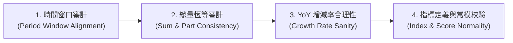

# 數據品質與統計邏輯強制檢核標準作業程序 (Data Quality Audit SOP)

本 Skill 定義每次交付涉及數據統計、ETL 計算、API Payload 或前端圖表呈現時，**必須強制執行的 4 道數據檢核關卡**。

---

## 🎯 核心原則

1. **同基準對比（Apples to Apples）**：
   - 累計數據（如 2026 年前 5 個月累計）**必須嚴格對比** 去年同期累計（2025 年前 5 個月累計），**嚴禁拿「5 個月累計」對比「1 個月單月」或「12 個月全年度」**！
2. **總分項恆等（Aggregation Identity）**：
   - 22 縣市分項加總必須等於「全國總計」（誤差容許 $\le 0.01\%$ 浮點四捨五入）。
3. **指標公式與常模透明（Transparent Indices）**：
   - 任何衍生綜合指標（如安全指數、治安燈號）必須有明確的權重公式與分母定義，不可出現無常模的「黑箱數字」。
4. **極端值防禦（Anomaly Sanity Bounds）**：
   - 任何增減百分比若超過 $\pm 100\%$，必須標註原因並審計分母是否異常過小或存在資料對齊錯誤。

---

## 📋 四階段數據檢核清單 (4-Stage Data Audit Checklist)



### 檢核 1：時間窗口審計 (Period Window Alignment)
- [ ] 若當前模式為「年度累計（X_annual，涵蓋 1~N 月）」：
  - 各縣市與主題的 `previous_year_total` 必須為**去年 1~N 月之各月加總**，而非去年的第 N 月單月。
- [ ] 若當前模式為「單月數據（YYYYMM）」：
  - 去年同期必須為 `(YYYY-1)MM` 單月。

### 檢核 2：總量與分項恆等審計 (Sum & Part Consistency)
- [ ] 全國總案件數 $\approx \sum_{i=1}^{22} \text{縣市案件數}$。
- [ ] 各主題案件數 $\approx \sum \text{該主題細項罪名件數}$。

### 檢核 3：YoY 增長率合理性 (Growth Rate Sanity)
- [ ] 當全國為負成長（如 -5%）時，不可能 22 縣市全部出現暴增 +400% 以上；若出現此現象，代表分母時間窗口查錯，屬於嚴重邏輯缺陷。

### 檢核 4：指數與評分常模 (Index Transparency)
- [ ] 安全指數（Safety Index）需具備加權常模（如 0~100 分，80分以上為平穩安全）。

---

## 🛠️ 自動化驗收檢查指令
在交付或更新 ETL 數據後，必須執行：
```bash
python scripts/sync_summary_reports.py --verify-data-quality
```
或執行資料檢核腳本確認 `yoy_pct` 均值在合理統計區間內。
