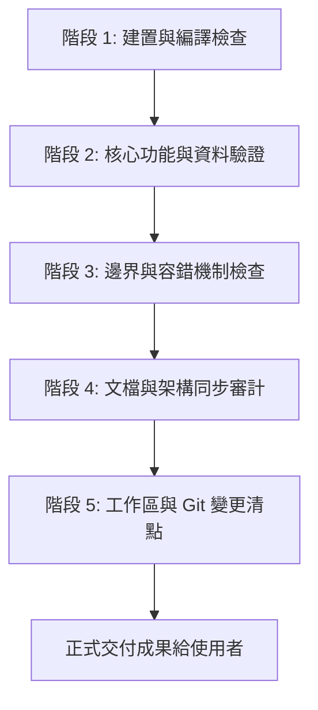

# 任務品質驗收標準作業程序 (Quality Acceptance SOP)

本 Skill 定義每次交付任務、提交成果或結束對話階段前必須執行的標準驗收步驟。透過嚴格的驗證流程，杜絕「代碼未測試」、「建置失敗」、「文檔與實現不一致」、「殘留暫存檔案」等問題。

---

## 🎯 核心原則

1. **驗證勝於假設（Verify, Don't Assume）**：凡是修改過代碼，必須實際執行建置或測試指令確認結果，不能憑肉眼或猜測交付。
2. **零阻礙交付（Zero-Defect Delivery）**：交付時不能留有未處理的 Lint 錯誤、型別錯誤或編譯報錯。
3. **文檔即時代碼化（Docs As Code）**：功能或架構有變更時，必須同步更新 `README.md`、架構圖與使用說明。
4. **工作區整潔（Clean Working Directory）**：提交前務必清理 debug 日誌、臨時檔案與未追蹤的垃圾檔案。

---

## 📋 五階段驗收標準流程 (5-Stage Acceptance Flow)



---

### 階段 1：建置與編譯驗收 (Build & Syntax Verification)

依據專案類型執行相應的建置/語法檢查：

* **Web 前端專案（Next.js / Vite / React）**：
  ```bash
  npm run build
  # 或 npm run lint / npx tsc --noEmit
  ```
  - ✅ 確認所有靜態頁面生成成功（如 `Generating static pages (X/X)`）。
  - ✅ 確認無語法錯誤、缺少 import、未宣告變數或型別錯誤。
  
* **Python / 後端專案**：
  ```bash
  # 語法編譯檢查
  python -m py_compile scripts/*.py
  # 單元測試執行
  pytest 或 python -m unittest
  ```
  - ✅ 確認所有依賴均有載入路徑或列在 `requirements.txt`。

---

### 階段 2：核心功能與資料驗證 (Functional & Data Flow Verification)

* **數據管道與 ETL**：
  - 執行主要資料更新或編譯腳本，確認輸出與狀態碼為 0。
  - 檢查資料庫（SQLite / PostgreSQL / DuckDB）中的資料筆數與結構完整性。
* **API 與端點驗證**：
  - 針對新建立或調整過的 API 路由，確認正常請求能取得 200 狀態碼與正確 Payload。
* **UI 互動與渲染**：
  - 確認前端組件沒有無效的 Key、缺少 Props 或 Hydration Mismatch 警告。

---

### 階段 3：邊界條件與容錯機制驗收 (Resilience & Fallback Audit)

* **無外部連線 / 離線模式**：
  - 若外部雲端資料庫中斷（如 Supabase 關閉），系統是否有本地 SQLite 或靜態 JSON 的自動 Fallback？
* **空值與異常數據處理**：
  - 遇到空陣列、無歷史月份、首月無 YoY 比較值時，介面是否安全處理，不致白屏崩潰。
* **全自動排程獨立性**：
  - 雲端排程（如 GitHub Actions）是否在無人值守與地端關機情況下能獨立閉環運行。

---

### 階段 4：文檔與註釋同步 (Documentation & Architecture Sync)

* **更新 `README.md`**：
  - [ ] 架構圖（Mermaid）是否反映最新的資料流？
  - [ ] 依賴項目、環境變數與指令是否與代碼一致？
  - [ ] 移除已過時或已被取代的舊方案描述（如舊工具、廢棄端點）。
* **代碼註釋與代碼符號連結**：
  - 確保公開函式與模組具有清晰的 Docstring / JSDoc 說明。

---

### 階段 5：工作區與 Git 變更清點 (Clean Workspace & Git Hygiene)

* **執行狀態檢查**：
  ```bash
  git status
  ```
* **核對清單**：
  - [ ] 無多餘的 `.tmp`、`test_*.json`、`.log` 等臨時除錯檔。
  - [ ] `.gitignore` 是否已妥善排除環境變數（`.env`）、`node_modules/`、`__pycache__/`。
  - [ ] 刪除已確認廢棄的舊目錄或檔案（避免死代碼殘留）。

---

## 🏁 交付前必填驗收核對表 (Acceptance Checklist)

在每次完成任務回覆使用者時，在心中逐項比對確認：

```markdown
- [x] 1. 建置測試：npm run build / 測試指令 100% 通過無報錯。
- [x] 2. 邏輯運作：核心功能經過實際執行驗證，輸出與預期一致。
- [x] 3. 容錯健全：具備極限邊界與例外容錯（Fallback）機制。
- [x] 4. 文檔齊全：README 與技術指南已同步至最新狀態。
- [x] 5. 工作區整潔：無殘留垃圾檔案，Git 狀態乾淨分明。
```
