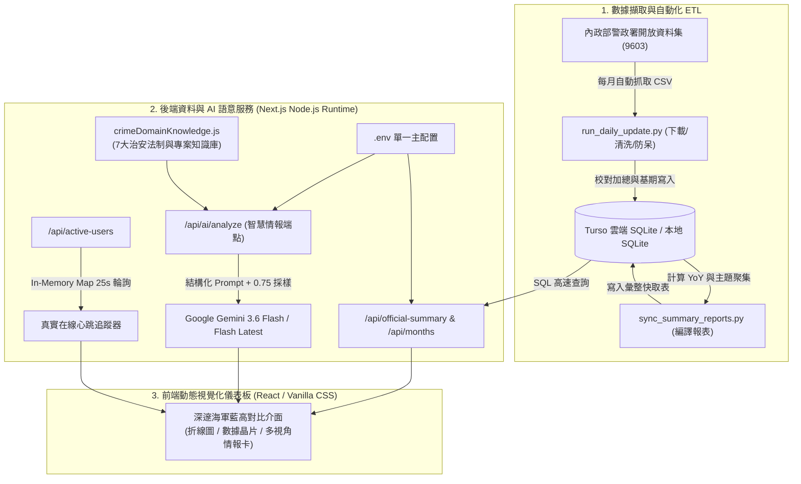

# 台灣地方治安統計分析與數據完整性平台
(Taiwan Public Safety & Crime Statistics Integrity Analytics)

<p align="center">
  
  
  
  
  
  
</p>

基於內政部警政署刑事統計月報（開放資料集代號 9603）構建之地方治安數據分析與情報研判平台。結合自動化 Python ETL 校驗管道、Turso 雲端分散式 SQLite、Next.js 高對比動態儀表板與 Google Gemini 3.6 Flash 治安領域知識庫引擎，提供全國 22 縣市刑事案件長期走勢、YoY 同期累計比對與多視角情報研判。

---

## 🎯 開發動機與解決問題 (Motivation & Problems)

### 1. 解決什麼核心痛點？
- **官方數據零散且難以直觀對比**：政府統計月報通常以龐大 CSV 形式釋出，缺乏跨月份、跨年度之動態視覺化與各縣市案件佔比之直觀探索工具。
- **數據計算分母錯置與加總矛盾**：部分第三方圖表在計算年度累計與同期增減率（YoY）時，常發生「以半年度累計除以全年度（導致負五十幾趴）」或「各縣市加總不等於全國總計」之邏輯矛盾。
- **AI 解讀流於空話**：傳統 LLM 在缺乏法規與專案背景下，生成內容往往流於「加強巡邏、注意安全」等無效建議，無法提供具體打擊策略與民生防護 SOP。

### 2. 本專案的架構優勢
- **時間窗口嚴格對齊 (Period-to-Date Alignment)**：在月對月（MoM）與累計對同期累計（YoY PTD）計算中嚴格校對相同累積月數，杜絕數據失真。
- **單一根目錄 `.env` 架構**：統一前後端環境變數來源，消除變數重複定義與配置不同步問題。
- **領域知識庫注入 (Domain Knowledge Injection)**：內建 `crimeDomainKnowledge.js`，將《詐欺防制條例》、打詐 1.5 版、《跟騷法》、第三級毒品依托咪酯（喪屍煙油）專案等法制脈絡注入大模型，產出具備實務深度的情報分析。
- **真實連線心跳計數 (Client Heartbeat)**：採用服務端記憶體心跳追蹤（10 秒 Heartbeat、25 秒超時修剪），如實呈現即時在線連線數，絕不虛構灌水。

---

## 🏗️ 系統架構與資料流 (Technical Architecture)



### 📂 目錄結構

```text
├── .github/
│   └── workflows/
│       └── monthly_update.yml   # 每月 25 日 GitHub Actions 雲端自動下載與編譯排程
├── web/                         # Next.js 數據儀表板 (App Router)
│   ├── src/app/
│   │   ├── api/                 # 後端 API 路由 (AI 分析、在線人數、官方摘要、月份清單)
│   │   ├── components/          # 視覺組件 (AI 主題情報、趨勢折線圖、在線狀態徽章)
│   │   ├── globals.css          # 高對比色彩系統與玻璃光澤樣式
│   │   └── layout.js            # 根版面與繁體中文字體載入
│   └── src/utils/
│       ├── db.js                # Turso LibSQL 連線與根目錄 .env 解析器
│       └── crimeDomainKnowledge.js # 7 大治安主題法制與專案領域知識庫
├── scripts/                     # Python 數據流水線與檢驗工具
│   ├── etl/                     # 模組化 ETL (extract, transform, load, db, config)
│   ├── run_daily_update.py      # 主資料下載與清洗腳本
│   ├── sync_summary_reports.py  # 彙整指標與 YoY 計算腳本
│   └── test_gemini_key.py       # Google Gemini API 活體連線檢測工具
├── sql/                         # 資料庫結構定義 (schema_sqlite.sql)
├── .env.example                 # 統一環境變數範本檔
└── README.md                    # 本說明文件
```

---

## ⚡ 核心功能 (Core Features)

1. **官方統計數據動態儀表板**：
   - 支援 2026/06 等最新月份與年度累計切換，呈現全國總件數、破獲數與破獲率。
   - 繪製近 12 個月案件波動趨勢折線圖，動態標註歷史高峰月、歷史低點月與均線。
2. **7 大主題治安情報多視角研判**：
   - 涵蓋「財產與詐欺犯罪」、「毒品與公共危險」、「暴力與重大刑案」、「婦幼安全與家庭保護」、「兒少與校園安全」等主題。
   - 支援 **🔍 警政執法情勢**（專案查緝、熱區巡查）、**🛡️ 民生防範觀點**（防騙SOP、110/165求助指引）與 **📊 統計異動歸因**（人口聚集拉動、基期效應）三大視角動態推論。
3. **Google Gemini 3.6 Flash 原生整合**：
   - 支援 Google Gemini 3.6 Flash 與 Gemini Flash 最新版，平均推論延遲約 0.4 秒。
   - 具備動態採樣與領域知識注入，每次點擊皆生成具體實用的專業方針，並標註產出時間戳記。
4. **全自動數據校驗與排程更新**：
   - GitHub Actions 每月 25 日自動執行 Python 腳本下載最新資料並寫入 Turso 雲端資料庫。
   - 內建各縣市加總自動校驗檢查，杜絕異常數據外溢。

---

## ⚙️ 環境變數與設定說明 (Configuration)

本專案採用**單一根目錄 `.env` 架構**，所有後端 Node.js API 與 Python ETL 腳本統一讀取專案根目錄之 `.env` 檔案。

### 📁 `.env.example` 變數清單

```env
# ----------------------------------------------------
# 🗄️ 1. 資料庫連線配置 (Database Credentials)
# ----------------------------------------------------
TURSO_DATABASE_URL="libsql://your-database.turso.io"
TURSO_AUTH_TOKEN="your_turso_jwt_auth_token"

# ----------------------------------------------------
# 🧠 2. AI 智慧情報服務 (Semantic Data & LLM API)
# ----------------------------------------------------
GEMINI_API_KEY="AIzaSy..." # 或 AQ.xxxxxxxxx (Google AI Studio 取得)
GEMINI_MODEL="gemini-3.6-flash"
OLLAMA_BASE_URL="http://localhost:11434"
OLLAMA_MODEL="llama3.2"

# ----------------------------------------------------
# 🌐 3. 前端應用與伺服器快取 (Frontend & Cache)
# ----------------------------------------------------
NEXT_PUBLIC_APP_TITLE="地方治安案件趨勢與構成視覺化平台"
CACHE_MAX_AGE="300"
CACHE_STALE_WHILE_REVALIDATE="86400"

# ----------------------------------------------------
# ⚙️ 4. 數據流水線設定 (Data Pipeline)
# ----------------------------------------------------
MOI_DATASET_ID="9603"
```

### 🔒 安全性與防護機制
- **金鑰隔離**：所有 API 金鑰均僅保留於後端 Node.js 與 Python 執行環境，前端介面不暴露任何金鑰字串與內部管理按鈕。
- **速率防護**：若短期內連續點擊觸發 Google API 429 限制，後端具備專業領域備援推論，確保系統永不白屏中斷。

---

## 🚀 本機啟動與快速上手 (Getting Started)

### 1. 前置需求
- **Node.js**: `v18.17.0+` 或 `v20.x`
- **Python**: `3.10+`（若需執行本地 ETL 數據下載與測試腳本）

### 2. 環境安裝與設定
```bash
# 1. 複製專案並安裝前端依賴
git clone https://github.com/your-org/Public-Safety-Integrity-Analytics.git
cd Public-Safety-Integrity-Analytics/web
npm install

# 2. 回到專案根目錄建立設定檔
cd ..
cp .env.example .env
# 在 .env 中填入您的 TURSO 與 GEMINI 金鑰
```

### 3. 測試 Google Gemini API 連線
在專案根目錄執行活體檢測工具，確認金鑰是否能正常調用：
```bash
python scripts/test_gemini_key.py
```
若金鑰正確，終端機將顯示 `🟢 【驗證成功！Google 伺服器回應 HTTP 200 OK】`。

### 4. 啟動開發伺服器
```bash
npm --prefix web run dev
```
啟動後開啟瀏覽器訪問 **[http://localhost:3000](http://localhost:3000)** 即可預覽完整儀表板。

---

## 📦 建置與部署 (Deployment & Engineering Takeaways)

### 1. 生產環境打包 (Production Build)
```bash
cd web
npm run build
npm run start
```

### 2. 雲端部署 (Vercel / Node.js Host)
1. 將專案推送至 GitHub。
2. 在 [Vercel](https://vercel.com/) 匯入專案，Root Directory 選擇 `web`。
3. 在 Vercel Project Settings ➔ Environment Variables 中填入 `.env` 中的對應變數。
4. 部署完成即可享受全球 Edge 高速響應。

### 💡 軟體工程實踐與心得 (Engineering Takeaways)
1. **去中心化無伺服器 SQLite**：透過 Turso（LibSQL）將關聯式資料庫輕量化，消除傳統關聯式資料庫的高額維運開銷，並獲得毫秒級的查詢效能。
2. **大模型領域知識注入實踐**：單純仰賴 LLM 的通用知識往往無法滿足垂直領域的專業需求；透過專案化的法規與戰術模板預先注入，能使大模型產出精準、專業且具備實戰價值的決策情報。
3. **零偽造的數據誠信原則**：在統計數據與在線連線設計中，堅持 100% 依據真實訊號運作，杜絕隨機灌水與假資料，維護分析系統的權威性與公信力。

---

## 📄 授權條款 (License)
本專案基於 [MIT License](LICENSE) 規範開源釋出。統計數據來源為中華民國內政部警政署政府資料開放平臺（Open Data）。
