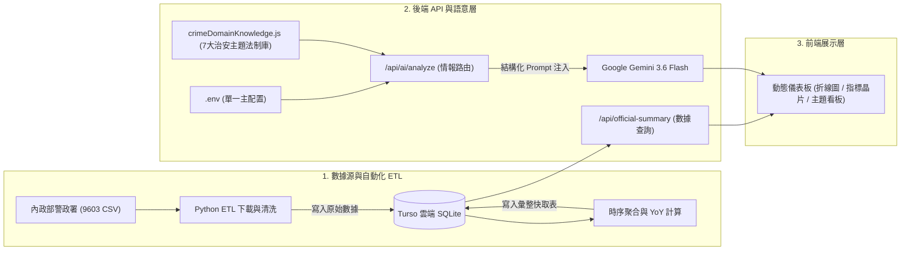

# 台灣地方治安統計數據分析與情報研判平台
(Taiwan Public Safety Statistics & Crime Intelligence Platform)

基於中華民國內政部警政署刑事統計月報（政府資料開放平臺資料集代號：9603）建構之治安時序監測、統計指標校對與結構化情報研判系統。結合自動化 Python ETL 數據管道、Turso 分散式 SQLite、Next.js 動態儀表板與 Google Gemini 3.6 Flash 領域知識庫引擎，提供全國 22 縣市刑事案件長期趨勢與多視角情報分析。

🔗 [**Live Demo**](https://public-safety-integrity-analytics.vercel.app/)

---

## 💡 開發動機與解決問題 (Motivation & Problem Statement)

1. **官方統計資料分散且缺乏時序視覺化**：
   政府每月釋出的刑事月報主要為各別月份的獨立 CSV 檔案，一般使用者與分析人員難以直觀掌握跨年度、跨月份之長期波動與各縣市案件佔比。
2. **時間窗口錯置與計量口徑不一致 (Period-to-Date Alignment)**：
   在計算年度累計與同期增減率（YoY）時，若未嚴格對齊相同的統計月數（例如以 6 個月累計除以全年度 12 個月總量），將導致嚴重的數值偏誤。本系統在 ETL 與前端聚合中導入嚴格的累積月數對齊機制。
3. **大語言模型在垂直領域缺乏專業脈絡**：
   通用 LLM 在缺乏特定法制與實務背景時，輸出的治安建議往往流於泛泛之論。本專案透過結構化領域知識庫（`crimeDomainKnowledge.js`），在呼叫 API 前注入台灣現行治安專案、法規依據與作案手法脈絡，使推論結果具備實務參考價值。

---

## 🏗️ 技術架構與資料流 (Technical Architecture)

### 技術選型

| 面向 | 選用技術 |
| :--- | :--- |
| **前端框架** | Next.js 14.2 (App Router)、React 18 |
| **樣式設計** | 原生 CSS 變數系統 (CSS Variables)、高對比色彩規範、RWD 響應式版面 |
| **資料庫儲存** | Turso (LibSQL 分散式 SQLite)、本地 SQLite 開發備援 |
| **資料管道 (ETL)** | Python 3.10+、Pandas、Requests、GitHub Actions (每月 25 日自動排程) |
| **AI 語意服務** | Google Gemini 3.6 Flash / Gemini Flash Latest、Ollama (本地離線備援) |
| **雲端部署** | Vercel (Frontend & Edge API) |

### 系統資料流向圖 (Data Flow)



### 專案目錄結構

```text
Public-Safety-Integrity-Analytics/
├── .github/
│   └── workflows/
│       └── monthly_update.yml   # 每月 25 日自動執行 Python ETL 雲端排程
├── web/                         # Next.js 全端應用
│   ├── src/app/
│   │   ├── api/                 # 後端 API 路由 (ai/analyze, official-summary, months, active-users)
│   │   ├── components/          # 前端 UI 組件 (AiTopicTrendAnalysis, LineChart, Header)
│   │   ├── globals.css          # 全局樣式與高對比色彩變數
│   │   └── layout.js            # 根版面配置
│   └── src/utils/
│       ├── db.js                # Turso LibSQL 連線與環境變數解析
│       └── crimeDomainKnowledge.js # 7 大治安主題法制與執法專案知識庫
├── scripts/                     # Python 數據流水線與檢驗工具
│   ├── etl/                     # 模組化 ETL (extract, transform, load, db, config)
│   ├── run_daily_update.py      # 主資料下載與寫入腳本
│   ├── sync_summary_reports.py  # 統計指標聚合與 YoY 計算腳本
│   └── test_gemini_key.py       # Google Gemini API 終端機連線檢驗工具
├── sql/                         # 資料庫 Schema 定義 (schema_sqlite.sql)
├── .env.example                 # 統一環境變數範本檔
└── README.md                    # 專案技術文件
```

---

## ⚡ 核心功能與計量定義 (Core Features & Metrics)

### 1. 時序指標與統計口徑定義
- **同期累計增減率 ($YoY_{PTD}$)**：
  $$YoY_{PTD} = \frac{\text{本年累計至當月案件數} - \text{去年同期累計案件數}}{\text{去年同期累計案件數}} \times 100\%$$
  嚴格對齊時間窗口，杜絕將半年度數據與全年度數據直接比對所產生之計算偏誤。
- **破獲率 (Clearance Rate)**：
  $$\text{破獲率} = \frac{\text{破獲件數}}{\text{發生件數}} \times 100\%$$

### 2. 7 大治安主題多視角情報研判
系統依據選定主題，自動自 `crimeDomainKnowledge.js` 提取對應之法規依據與專案背景，並支援三種分析視角：
- **🔍 警政執法情勢**：聚焦於專案查緝策略、熱區巡查部署、科技偵查與跨轄區溯源。
- **🛡️ 民生防範觀點**：聚焦於常見犯罪手法識別、民眾日常自我保護要領及 110/165/113 求證流程。
- **📊 統計異動歸因**：聚焦於人口集中度拉動效應、特定節慶季節性週期及專案登錄時差等計量維度。

### 3. 主題領域知識庫注入矩陣

| 治安主題 | 適用法規依據 | 重點執法專案與打擊手法 |
| :--- | :--- | :--- |
| **財產與詐欺犯罪** | 《詐欺犯罪危害防制條例》、《洗錢防制法》 | 新世代打擊詐欺策略 1.5 版、165 聯防機制、假投資群組溯源、人頭帳戶清查 |
| **毒品與公共危險** | 《毒品危害防制條例》、《刑法第185條之3》 | 安居緝毒專案、清源專案 3.0、依托咪酯（喪屍煙油）專案查緝、毒駕快篩與閉鎖式路檢 |
| **婦幼安全與家庭保護** | 《家庭暴力防治法》、《跟蹤騷擾防制法》 | 跟騷即時告誡書核發、性私密影像下架封網機制、高危機家暴個案跨網絡列管 |
| **暴力與重大刑案** | 《組織犯罪防制條例》、《刑法第150條》 | 全國同步掃黑、雷霆演習、快打部隊 3~5 分鐘現場壓制、加重聚眾鬥毆處罰 |
| **兒少與校園安全** | 《少年事件處理法》、《性平三法》 | 校園周邊護童專案、防制幫派吸收少年、偏差行為行政輔導先行機制 |

---

## ⚙️ 環境變數與安全設定 (Configuration & Security)

本專案採用**單一根目錄 `.env` 架構**，所有後端 Node.js API 與 Python ETL 腳本統一讀取專案根目錄之 `.env` 檔案。

### 環境變數清單 (`.env.example`)

| 配置分類 | 變數名稱 | 範例 / 預設值 | 說明 |
| :--- | :--- | :--- | :--- |
| **資料庫儲存** | `TURSO_DATABASE_URL` | `libsql://db-name.turso.io` | Turso 分散式 SQLite 資料庫連線端點 (必填) |
| | `TURSO_AUTH_TOKEN` | `eyJhbGci...` | Turso JWT 存取權限權杖 (必填) |
| **AI 語意服務** | `GEMINI_API_KEY` | `AIzaSy...` 或 `AQ...` | Google AI Studio 發放之 API 金鑰 (選填) |
| | `GEMINI_MODEL` | `gemini-3.6-flash` | Google Gemini 模型名稱 (預設為 `gemini-3.6-flash`) |
| | `OLLAMA_BASE_URL` | `http://localhost:11434` | 本地 Ollama 服務端點 (本地離線備援) |
| | `OLLAMA_MODEL` | `llama3.2` | 本地 Ollama 模型名稱 |
| **應用與快取** | `NEXT_PUBLIC_APP_TITLE` | `地方治安案件趨勢與構成視覺化平台` | 網頁主標題 |
| | `CACHE_MAX_AGE` | `300` | HTTP API 伺服器快取秒數 (5 分鐘) |
| **數據流水線** | `MOI_DATASET_ID` | `9603` | 內政部警政署刑事月報開放資料集編號 |

### 安全與防護機制說明

| 防護機制 | 實作方式與白話說明 |
| :--- | :--- |
| **金鑰隔離** | API Key 僅留存於後端 Node.js 與 Python 執行環境，前端介面不暴露任何機敏字串與內部管理選項。 |
| **速率防護與備援** | 若短時間內高頻重複請求觸發 Google API 429 速率限制，後端具備多面向領域推論備援，確保系統穩定不中斷。 |

---

## 🚀 本機啟動與快速上手 (Getting Started)

### 1. 前置環境需求
- **Node.js**: `v18.17.0` 以上（建議使用 Node.js 20 LTS）
- **Python**: `3.10` 以上（執行資料庫更新與 API 連線測試時需要）

### 2. 安裝與環境設定
```bash
# 1. 複製專案庫並安裝前端依賴
git clone https://github.com/your-org/Public-Safety-Integrity-Analytics.git
cd Public-Safety-Integrity-Analytics/web
npm install

# 2. 回到專案根目錄建立設定檔
cd ..
cp .env.example .env
# 請編輯 .env 填入您的 TURSO 與 GEMINI 參數
```

### 3. 驗證 Google Gemini API 連線
在專案根目錄執行檢驗工具，確認金鑰與遠端 API 狀態：
```bash
python scripts/test_gemini_key.py
```
若連線正常，終端機將回傳 `🟢 【驗證成功！Google 伺服器回應 HTTP 200 OK】`。

### 4. 啟動開發伺服器
```bash
npm --prefix web run dev
```
啟動完成後，開啟瀏覽器訪問 `http://localhost:3000`。

---

## 📦 雲端部署 (Deployment)

### 1. 生產環境打包 (Production Bundle)
```bash
cd web
npm run build
npm run start
```

### 2. 雲端平台部署 (Vercel)
1. 將程式碼推送至 GitHub 專案庫。
2. 在 Vercel 建立專案，設定 **Root Directory** 為 `web`。
3. 於 Vercel 專案設定中填入對應的環境變數（`TURSO_DATABASE_URL`, `TURSO_AUTH_TOKEN`, `GEMINI_API_KEY` 等）。
4. 點擊 Deploy 即可完成部署。

---

## 📄 資料來源 (Data Source)
本專案統計數據源自「中華民國內政部警政署政府資料開放平臺 - 刑事件數統計（資料集代號：9603）」，資料依中華民國政府資料開放授權條款規範運用。

---

## 💡 開發收穫與技術心得 (Key Takeaways)

- **無伺服器分散式 SQLite 架構實踐**：
  捨棄繁重的傳統關聯式資料庫伺服器，改採 Turso（基於 LibSQL 的分散式 SQLite），不僅大幅降低資料庫維運成本，更在 Edge 與 Node.js 環境中獲得毫秒級查詢效能。
- **垂直領域大模型 Prompt 知識注入**：
  單純依賴通用 LLM 的常識往往產出泛泛之論；本專案透過結構化知識庫（`crimeDomainKnowledge.js`）將台灣現行法規（《打詐條例》、《跟騷法》等）與執法專案預先注入，使大模型能夠輸出具備實戰價值之專業研判。
- **時序數據窗口嚴格對齊防呆 (Period-to-Date Alignment)**：
  在跨月份與跨年度統計計算中，嚴格校對相同累積月數，消除常見的分母錯置計算錯誤，建立具備高度公信力的官方統計分析標準。
- **單一根目錄環境變數治理**：
  統一 Python ETL 數據管道與 Next.js 全端應用的環境變數來源，消除跨語言、跨目錄配置不同步的維護痛點。
- **全自動雲端排程維運**：
  透過 GitHub Actions 虛擬機實現每月 25 日定時抓取、清洗與編譯，達成地端電腦 24 小時關機依然能穩定自動更新的自動化管線。
