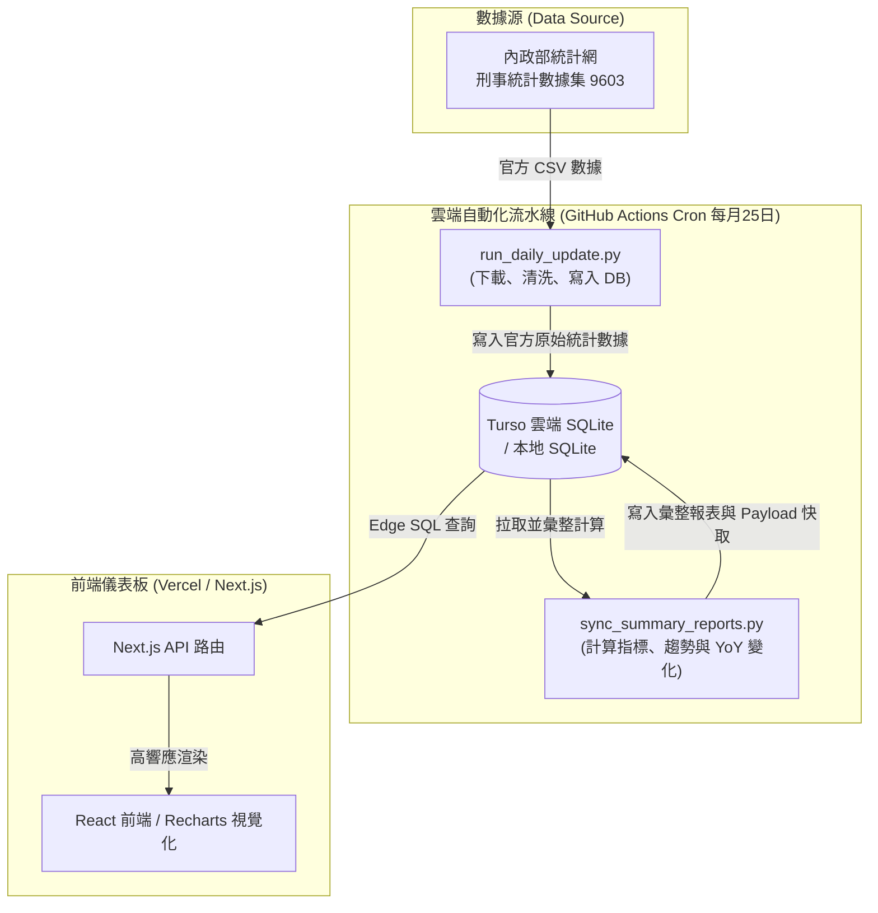

# 台灣地方治安統計數據分析平台 

(Taiwan Local Public Safety Statistics & Data Integrity Audit Platform)

<p align="center">
  
  
  
  
  
  
</p>

💡 **本治安統計分析平台結合 Next.js 數據儀表板、Python 數據校對 ETL 及 Turso 雲端原生 SQLite 架構。**

每月由 GitHub Actions 雲端自動抓取內政部警政署刑事案件開放資料集（代號 9603），經嚴謹的數據清洗、校對加總與治安指標計算後，直接寫入雲端分散式 SQLite（Turso）。前端 Next.js 透過 Edge API 高速查詢，提供民眾直觀理解全國各縣市犯罪趨勢、案件分布與 YoY 增減變化。

🔗 [**Live Demo 儀表板線上預覽**](https://public-safety-integrity-analytics.vercel.app/)

---

## 🎯 專案核心特色

1. **官方統計資料作為權威基礎**：
   本平台使用內政部統計月報中的刑事案件開放資料集。相較於非結構化新聞或網路聲量，官方受（處）理刑事統計具有長期一致性與可回溯性，更適合作為趨勢比較與治安研判的基礎。
2. **內建數據完整性校對機制（Audit & Checksums）**：
   政府開放資料在實務上偶有欄位格式變動、月份資料未齊或縣市加總與全國總計不一致等問題。本專案在 ETL 流程中加入自動加總檢查，確保「各縣市加總」等於「全國總計」；一旦出現差額會自動發出警報，防止未經確認的錯誤數據直接渲染至前端。
3. **Turso 雲端分散式 SQLite（0 JSON 垃圾檔案、0 維護負擔）**：
   捨棄易因閒置被刪除的外部資料庫或龐雜的本機靜態 JSON 檔案，全面採用 **Turso（基於 LibSQL 的分散式 SQLite）**。前後端直接透過 SQL 查詢資料，享受原生 SQLite 輕量優勢與 9GB 免費大額度。
4. **GitHub Actions 雲端全自動排程（地端關機無痛運行）**：
   每月 25 日凌晨 03:00 自動在 GitHub 雲端啟動 Ubuntu 虛擬機執行 Python ETL 下載最新月報、更新 Turso 資料庫。**開發者個人電腦 24 小時關機亦能穩定自動更新**。

---

## 🏗️ 系統架構與資料流



---

## 📂 目錄結構與模組說明

```text
├── .github/
│   └── workflows/
│       └── monthly_update.yml   # [自動化] 每月 25 日 GitHub Actions 自動抓取與編譯排程
├── web/                         # Next.js 數據儀表板 (本專案前端)
│   ├── src/app/                 # App Router (首頁、API 路由、折線與堆疊圖表)
│   ├── src/utils/db.js          # Turso LibSQL 資料庫連線模組
│   └── package.json             # Next.js 專案依賴設定
├── scripts/                     # Python 數據流水線與編譯工具
│   ├── etl/                     # 結構化 ETL 套件 (核心處理邏輯)
│   │   ├── config.py            # 配置常數、犯罪案件對齊、顏色樣式
│   │   ├── db.py                # 跨資料庫連線 (Turso / SQLite / Postgres)
│   │   ├── extract.py           # 抓取並解析 MOI 刑事 CSV 檔
│   │   ├── transform.py         # 聚合月/年指標、YoY 計算、AI 趨勢研判
│   │   └── load.py              # 將彙整結果同步寫入 DB (crime_summary_reports)
│   ├── run_daily_update.py      # [主更新] 下載官方 CSV，對齊並寫入官方原始數據
│   ├── sync_summary_reports.py  # [主編譯] 計算統計指標、YoY 與主題分類
│   └── requirements.txt         # Python 依賴清單
├── data/
│   └── local/                   # 本地開發 SQLite 資料庫 (public_safety.sqlite)
├── sql/                         # 資料庫結構描述檔 (schema_sqlite.sql / schema_postgres.sql)
└── README.md                    # 本專案說明文件
```

---

## 🚀 部署與本地開發

### 1. 建立免費 Turso 資料庫（1 分鐘快速完成）
1. 至 [Turso 官網 (turso.tech)](https://turso.tech/) 註冊並建立一個免費資料庫（例如名為 `public-safety`）。
2. 在 Turso Dashboard 取得資料庫網址（URL）與 Token：
   ```env
   TURSO_DATABASE_URL="libsql://public-safety-[org].turso.io"
   TURSO_AUTH_TOKEN="your_turso_auth_token"
   ```
3. 在 SQL Editor 執行 `sql/schema_sqlite.sql` 建立資料表結構。

### 2. 環境變數配置
將上述變數填入 `.env`（本地開發）、GitHub Secrets（雲端排程）與 Vercel（前端託管）：
* `TURSO_DATABASE_URL`
* `TURSO_AUTH_TOKEN`

### 3. 本地執行資料庫更新與編譯
```bash
# 1. 下載最新月份官方資料並寫入 Turso
python scripts/run_daily_update.py --skip-existing --min-release-day 8

# 2. 自動計算最新治安指標與年度比較
python scripts/sync_summary_reports.py --latest-only
```

### 4. 本地啟動前端開發服務
```bash
cd web
npm install
npm run dev
```
啟動後訪問 `http://localhost:3000` 即可預覽完整儀表板。
